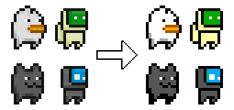
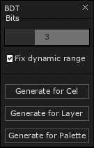

# Aseprite Scripts

## [Normal Map Tool](Normal-Map-Tool.lua)

Based on [Carlmartus's script](https://github.com/carlmartus/aseprite_normalmap)

Script for generating normal maps.

`Generate for Cel` generates normal map only for active cel.

`Generate for Layer` generates normal map for all cells in active layer. (use for animations)

## [Intravenous UI Icons Tool](Intravenous-UI-Icons-Tool.lua)

Script for generating Intravenous styled UI icons from sprites.

Script will ignore all colors except selected in menu. First is base color, second is highlight color.

## [Bit Depth Tool](Bit-Depth-Tool.lua)

Based on [Sandord's script](https://github.com/sandord/aseprite-scripts)

Script for reducing bit depth of colors.

`Generate for Cel` reduces bit depth only for active cel's colors.

`Generate for Layer` reduces bit depth for all cells' colors in active layer. (use for animations)

`Generate for Palette` reduces bit depth of the palette colors.

## License
[MIT](LICENSE)
