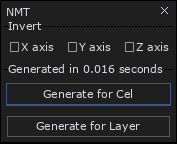
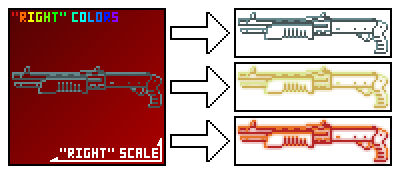

# Aseprite Scripts

## [Normal Map Tool](Normal-Map-Tool.lua)

Based on [Carlmartus's script](https://github.com/carlmartus/aseprite_normalmap)

Script for generating normal maps.

`Generate for Cel` generates normal map only for active cel.

`Generate for Layer` generates normal map for all cells in active layer (use for animations)

## [Intravenous UI Icons Tool](Intravenous-UI-Icons-Tool.lua)

Script for generating Intravenous styled UI icons from sprites.

Script will ignore all colors except `#64878c` (70, 84, 86) and `#465456` (100, 135, 140).

## License
[MIT](LICENSE)
